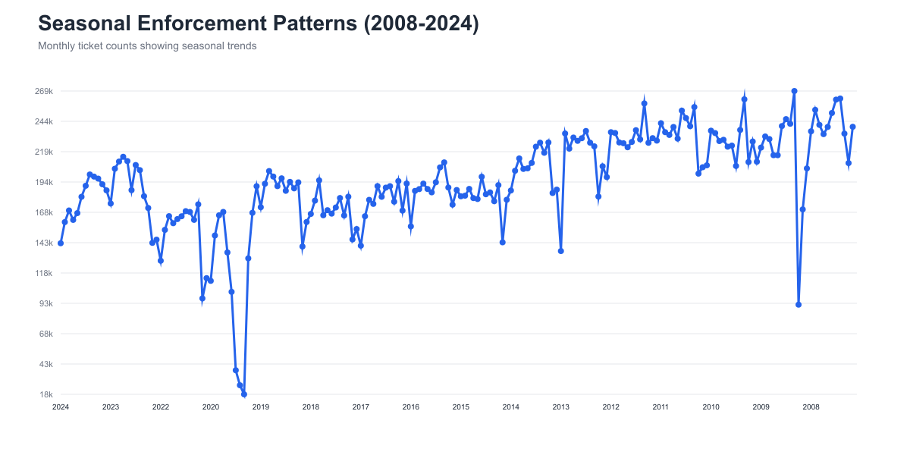
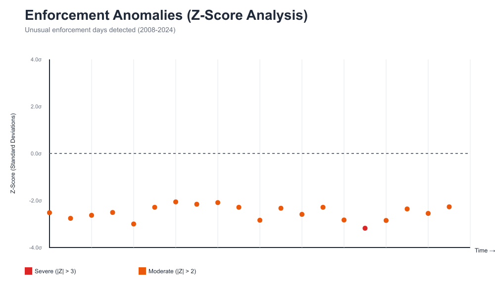
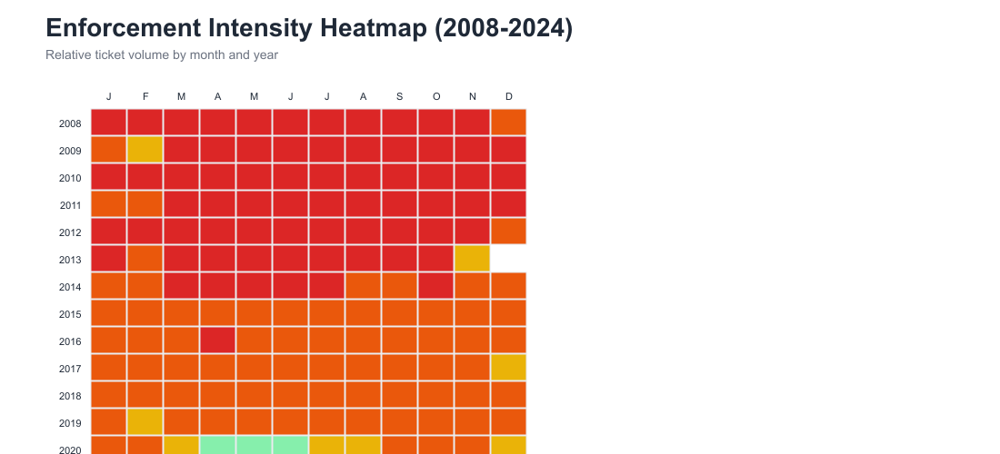
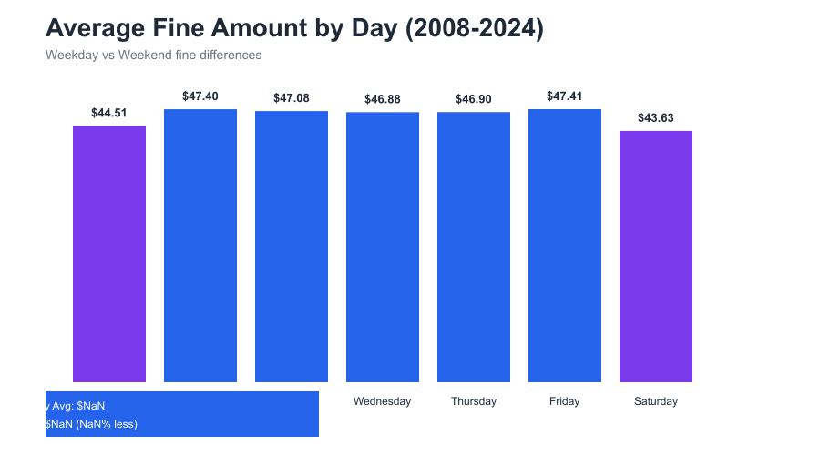

[

Parking tickets map where the city earns and drivers fume.

# Toronto Parking Insights

We turn Toronto’s open data into a living enforcement dashboard.
The map covers 40 million tickets between 2008 and 2024.
It tracks 319 red light cameras and 199 speed cameras.
PostGIS, Redis, and PMTiles keep tiles snappy across the GTA.

## Table of Contents

1. [Why it matters](#why-it-matters)
2. [Architecture](#architecture)
3. [Run it locally](#run-it-locally)
4. [Environment](#environment)
5. [Analysis & Visualizations](#analysis--visualizations)
6. [Data pipeline](#data-pipeline)
7. [Deployment](#deployment)
8. [Project structure](#project-structure)
9. [Contribution guide](#contribution-guide)
10. [Attribution](#attribution)
11. [Next steps](#next-steps)

## Why it matters

- Spot which streets mint $325 fines and pressure wards.
- Flag ASE corridors before residents ask “why here?”.
- Share hard numbers with reporters, councillors, and planners.

## Architecture

```
           +---------------------------+
           |  CKAN / Open Data APIs    |
           +-------------+-------------+
                         |
               (python src/etl)
                         v
 +------------------------------+      +-----------------------+
 | PostgreSQL 17 + PostGIS      |      | Redis (tiles + data)  |
 | • Raw datasets               |      | • Tile caches         |
 | • *_tiles partitions         |<---->| • Ward summaries      |
 | • TileSchemaManager helpers  |      | • Glow datasets       |
 +--------------+---------------+      +-----------+-----------+
                |                                 |
                | Postgres/Redis clients          |
                v                                 v
        +--------------------+      +-------------------------------+
        | Node/Express SSR   | ---> | MapLibre client (React/Vite)  |
        | • /api, /data      |      | • Points + choropleth layers  |
        | • MapTiler proxy   |      | • PMTiles protocol handler    |
        | • PMTiles manifest |      | • Viewport summaries          |
        +---------+----------+      +-------------------------------+
                  |
                  v
        +--------------------+
        | MinIO (PMTiles)    |
        | • Sharded point    |
        |   & ward datasets  |
        | • CDN/origin URLs  |
        +--------------------+
```

- Postgres stores raw datasets and quadkey tile tables.
- Redis caches viewport summaries and prebuilt tiles.
- The SSR server injects MapTiler keys and builds manifests.
- The client swaps between PMTiles and legacy XYZ on failure.

## Run it locally

```bash
git clone https://github.com/monuit/toronto-parking.git
cd toronto-parking

python -m venv .venv
source .venv/bin/activate  # Windows: .venv\Scripts\activate
pip install --upgrade pip
pip install -r requirements.txt

cd map-app
npm install
npm run dev:ssr
# optional: second terminal for client HMR
npm run dev
```

Visit <http://localhost:5173> for the SSR build and proxied APIs.

## Environment

Copy `.env.example` to `.env`.
Fill in Postgres, Redis, MapTiler, and MinIO credentials.

- `DATABASE_URL` must point at a PostGIS-enabled database.
- `REDIS_URL` holds tile blobs, ward summaries, and glow data.
- `MAPLIBRE_API_KEY` stays server-side when `MAPTILER_PROXY_MODE=proxy`.
- `PMTILES_*` values control shard location and CDN base URLs.
- Client vars (`VITE_*`) mirror backend paths for the browser bundle.

## Analysis & Visualizations

Toronto parking data reveals fascinating enforcement rhythms. We've analyzed 37+ million tickets (2008–2024) to uncover patterns:

### Key Findings

- **Daily Patterns**: Tuesday peaks at 5.8M tickets (+10% above average). Sundays drop 27% below average. **Weekends show 22% fewer tickets.**
- **Seasonal Trends**: March averages 209k tickets/month; February bottoms at 167k. **25% seasonal variance.**
- **Long-term Decline**: Enforcement dropped 21% from 2008 (217k/month) to 2024 (167k/month).
- **Holiday Impact**: Major holidays like Christmas show **50–72% reductions** (systematic policy).
- **Fine Escalation**: Average fines rose **95%** from ~$35 (2008) to ~$77 (2024).

### Visualization Gallery

  
*Weekday dominance: Tuesday is the busiest enforcement day; weekends are 22% lower.*

  
*Spring peaks and winter valleys show consistent 25% seasonal variance across 17 years.*

  
*Z-score analysis reveals 20+ special events—Christmas 2022 was the most severe anomaly (−72%).*

  
*Year-by-month heatmap shows the 2008 peak, COVID-19 dip (April–June 2020), and recovery.*

  
*Weekday fines average 10% higher than weekends; consistent pattern across 17 years.*


## Data pipeline

- Python ETL pulls monthly parking CSVs and camera workbooks.
- TileSchemaManager builds geom_3857 columns and quadkey prefixes.
- `scripts/pmtiles/build_pmtiles.py` batches tiles with ProcessPool compression.
- Upload scripts push shards to MinIO with immutable cache headers.
- Warmers fetch a 3×3 GTA grid each hour to keep caches hot.

## Deployment

1. Merge into `main` or push a monitored branch.
2. Railway uses `railway.json`:
   - Nixpacks builds with Node 22.
   - Runs `npm ci`, `npm run build:ssr`, and prepares PMTiles tools.
   - Starts via `node scripts/start-app-with-worker.mjs` (SSR + warmers).
3. Load secrets from `.env.example` into Railway’s environment tab.
4. Provision Postgres (enable PostGIS), Redis, and MinIO/S3 storage.
5. Deploy with `railway up --service web` or GitHub auto-deploy.
6. After deploy, verify:
   - `/api/pmtiles-manifest` returns `enabled: true` with correct URLs.
   - `/healthz` lists proxy mode, warmup metrics, and cache stats.
   - Tiles render without MapTiler 499/408 errors in the browser console.

Rotate credentials any time they leak during testing.

## Project structure

```
toronto-parking/
├─ map-app/
│  ├─ server/               # Express SSR, proxies, warmers, runtime config
│  ├─ src/                  # React components, contexts, layers, hooks
│  ├─ scripts/              # Client operational scripts (warmers, tiles)
│  └─ public/               # Static assets, styles, favicon
├─ scripts/                 # Python & Node automation (ETL, tiles, metrics)
│  ├─ pmtiles/              # Build, convert, upload PMTiles artefacts
│  └─ debug/                # Ad-hoc analytics utilities
├─ src/                     # Python ETL + tile services shared by tools
├─ shared/pmtiles/          # Shard manifests consumed by server + client
├─ tools/pmtiles/           # Node worker for multi-part uploads
├─ analysis/                # Notebooks, SQL experimentation
├─ requirements.txt         # Python dependencies
├─ map-app/package.json     # Node dependencies (engines >= 22.12)
└─ railway.json             # Railway build + start specification
```

## Contribution guide

Strong contributions keep the map trustworthy and fast.
Here is how to help without breaking production:

1. Open an issue when changing schemas or data contracts.
2. Branch from `main` and keep scope narrow.
3. Run `npm run lint`, `npm run build:ssr`, and relevant Python tests.
4. Document cache rebuilds or warmup steps in the PR body.
5. Wait for review before touching deployment secrets.

## Attribution

Data © City of Toronto under the Open Government Licence.
Map tiles © OpenStreetMap contributors and MapLibre.
Project by Moe — not affiliated with the City of Toronto.

## Next steps

Have an improvement in mind? Open an issue or start a feature branch (`feature/<summary>`). Run lint and build scripts before you ship, and call out any schema or cache rebuild tasks in the PR.
